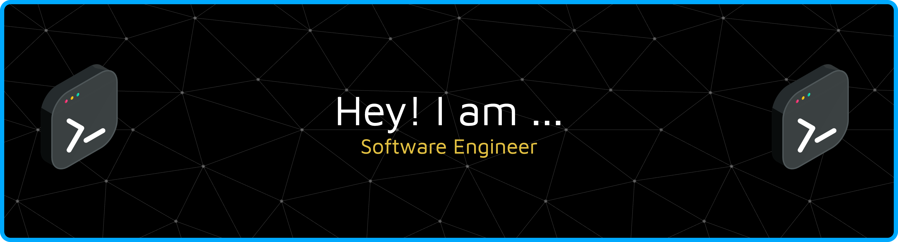

# Hi there 👋 I'm Abdul Harist Sundawa

**Software Engineer — Mobile Apps (Flutter)**
 
Fokus pada aplikasi mobile end-to-end: UI/UX, offline-first, integrasi pembayaran (QRIS), notifikasi real-time, dan distribusi ke Play Store / TestFlight.

<!-- Tambahkan email jika ingin ditampilkan:

-->

---

## 🚀 Currently working on

- **PDAM / Bablas v1 (QRIS Direct)** @ PT. Module Intracs Yasatama  
  Billing & pembayaran PDAM, **QRIS static/dynamic**, polling status, screenshot-to-gallery, notifikasi lokal/FCM, dan **offline cache (SQLite)**.
- Pipa rilis: signing, proguard/obfuscation, Play Console, dan persiapan iOS (profiling, assets, TestFlight).

## 🧰 Tech Stack

- **Mobile:** Flutter (Dart), Material 3, responsive layout, custom widgets
- **Payments:** QRIS generation, status polling, MD5 signing, webhook/notification
- **Backend/DevOps (exploring):** Go (REST), CI/CD dasar, Postman testing
- **Infra pendukung:** FCM/APNs, env management, error handling/observability

## 🧩 Highlights

- ✨ **Offline-first:** SQLite untuk registrasi/login dan histori transaksi
- 🔐 **Security & env:** variabel lingkungan (MID/TID/CLIENT_ID), signature MD5
- 🖼️ **UX:** OTP screen yang smooth (autofocus/auto-advance), QR preview & save
- 🔔 **Notifikasi:** local notification + FCM token management
- ♻️ **Resilience:** retry & polling adaptif untuk status pembayaran

## 💬 Ask me about

`Flutter · Dart · QRIS · FCM/APNs · SQLite · State management · App release`

## 🤝 Open to collaborate

- Mobile app (Flutter) untuk pembayaran, utility billing, atau aplikasi enterprise
- Integrasi QRIS/checkout, notifikasi real-time, dan arsitektur offline-first

## 📈 GitHub Stats

---

### Short Bio

Mobile-first software engineer. I build reliable Flutter apps with clean UI, offline-first data, and seamless QRIS payments. Let’s ship fast—and ship right.

 

<picture>
  <source media="(prefers-color-scheme: dark)" srcset="https://raw.githubusercontent.com/haristsundawa/haristsundawa/output/pacman-contribution-graph-dark.svg">
  <source media="(prefers-color-scheme: light)" srcset="https://raw.githubusercontent.com/haristsundawa/haristsundawa/output/pacman-contribution-graph.svg">
  
</picture>

###
